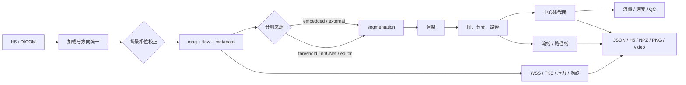

# 功能总览

## AutoFlow 的分析链

## 按任务选择功能

| 你想回答的问题 | 推荐功能 | 入口 |
| --- | --- | --- |
| 这组数据有没有被正确加载？ | Input & QC、质量报告 | GUI / CLI |
| 哪些体素属于目标血管？ | 导入、阈值、nnUNet、Labeler、手动编辑 | GUI / CLI / Python |
| 血管的拓扑和主干在哪里？ | Skeleton、Graph、Paths | GUI / CLI / Python |
| 某个位置的流量和速度是多少？ | Planes、Plane Metrics | GUI / CLI / Python |
| 血流是否有壁面剪切和能量耗散信息？ | WSS、TKE | CLI / GUI / Python；TKE 需要输入支持 |
| 压力变化和流动结构如何？ | Pressure、Vortex Kinematics | CLI / GUI / Python |
| 想看动态流动而不只看表格？ | Streamlines、Pathlines、Videos、PC-MRA | GUI / CLI |

## 读页面的方式

每个功能页都尽量回答七件事：它做什么、什么时候用、GUI 怎么用、CLI 怎么用、Python 怎么用、产生什么输出，以及要修改哪里。参数以表格为主，避免把配置名和医学含义混在一起。

## 先做几何，再做派生量

推荐的审阅顺序是：

1. 输入和单位
2. 背景相位校正
3. 分割
4. 骨架、图和路径
5. 截面和基础指标
6. WSS/TKE/压力/PWV/涡旋等派生量
7. 视频与报告导出

这样做的原因是：派生量的可信度依赖前面的坐标、速度、时间和空间范围。如果分割错了，后面的高精度算法也只会更精确地计算错误区域。
