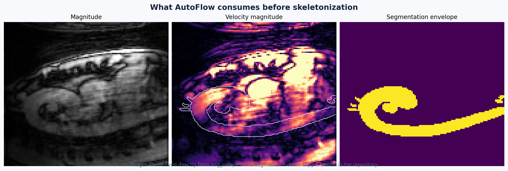
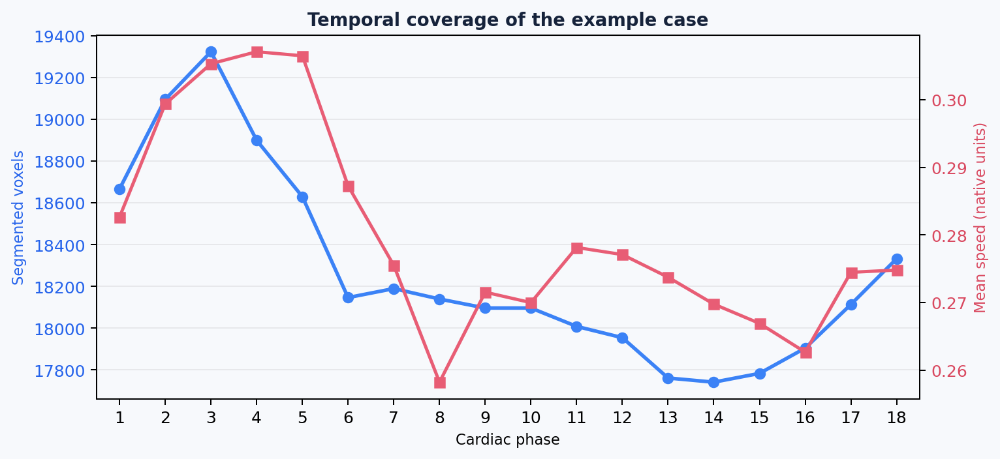

# 冷启动示例：主动脉 H5

## 目标

这是一条**从没有 `corr`、没有 `seg` 开始**的演示路径。它故意不把文件中可能存在的校正缓存或分割缓存当成前提，帮助你理解从原始 4D Flow 数据到可审阅结果的完整流程。

> 示例图来自用户提供的 Aorta 数据。仓库只保存派生的说明图，不保存原始医学 H5。运行时请替换为你有权限访问的本机路径。

## 示例输入

Linux/NAS 上的实际文件路径为：

```text
/nas-data2/ryy/CMR4DFlow2026/Segdata/data4seg_test/h5s_autoflow/Aorta_Center003_GE_15T_Voyager_Exam32324-12224896-C17-0021.h5
```

如果你的挂载点不同，只需替换路径；文件名可以保持不变。这个示例是 legacy complex H5，典型字段包括：

| 字段 | 形状 | 说明 |
| --- | --- | --- |
| `img_complex` | `108 × 112 × 36 × 18 × 4` | 空间 × 时间 × 通道；通道 0 是 magnitude，通道 1–3 是三方向复数速度编码 |
| `Resolution` | `3` | 三个空间方向的体素间距，单位通常为 mm |
| `Origin` | `3` | 体数据原点 |
| `VENC` | `3` | 三个速度编码方向的 VENC |
| `RR` | scalar | 心动周期相关元数据 |
| `segmask` | `108 × 112 × 36 × 18` | 本示例文件可能包含的 4D 分割；冷启动时我们不依赖它 |
| `corr` | `108 × 112 × 36 × 1 × 3` | 本示例文件可能包含的背景校正缓存；冷启动时我们不依赖它 |

## A. 创建真正的冷启动工作副本

不要直接在原始数据上删除字段，也不要在原始数据目录旁边复用以前的输出目录。先复制一份工作副本，并递归移除所有常见的校正/分割缓存：

```bash
RAW_CASE=/nas-data2/ryy/CMR4DFlow2026/Segdata/data4seg_test/h5s_autoflow/Aorta_Center003_GE_15T_Voyager_Exam32324-12224896-C17-0021.h5
CASE=./work/aorta_center003_without_cache.h5
OUT=./results/aorta_center003_cold_start
mkdir -p ./work
mkdir -p "$OUT"
```

用下面的脚本复制数据集；它保留原始属性和其它输入，只跳过名字为 `corr`、`corr_low`、`corr_high`、`segmask`、`segmentation` 或 `seg` 的节点：

```bash
python - <<'PY'
import h5py

source_path = "/nas-data2/ryy/CMR4DFlow2026/Segdata/data4seg_test/h5s_autoflow/Aorta_Center003_GE_15T_Voyager_Exam32324-12224896-C17-0021.h5"
target_path = "./work/aorta_center003_without_cache.h5"
removed_names = {"corr", "corr_low", "corr_high", "segmask", "segmentation", "seg"}

def copy_group(source_group, target_group):
    for name, item in source_group.items():
        if name.lower() in removed_names:
            continue
        if isinstance(item, h5py.Group):
            target_child = target_group.create_group(name)
            for key, value in item.attrs.items():
                target_child.attrs[key] = value
            copy_group(item, target_child)
        else:
            source_group.copy(item, target_group, name=name)

with h5py.File(source_path, "r") as source_file, h5py.File(target_path, "w") as target_file:
    for key, value in source_file.attrs.items():
        target_file.attrs[key] = value
    copy_group(source_file, target_file)

print(f"Created cold-start case: {target_path}")
PY
```

后面的命令都对 `CASE` 工作副本运行。原始文件保持不变；如果你的输入包含别的缓存命名，请先用 H5 浏览器检查并确认。

## B. 先检查输入，不急着跑全流程

```bash
autoflow-run "$CASE" \
  --output-dir "$OUT/input_check" \
  --skip-derived \
  --skip-plane-metrics
```

这一步的意义是验证 loader 能读出 `mag`、`flow`、`resolution`、`origin`、`venc` 和 `rr`。如果这里失败，先看[输入格式](inputs.md)，不要从分割或压力算法开始排查。

## C. 冷启动：显式运行校正和分割

在没有可用 `corr` / `seg` 的工作副本上运行：

```bash
autoflow-run "$CASE" \
  --output-dir "$OUT/full" \
  --bgc \
  --autoseg \
  --with pwv,wss,pg,vortex \
  --video plane,wss,pg
```

各选项的医学含义：

| 选项 | 作用 | 第一次使用时怎么理解 |
| --- | --- | --- |
| `--bgc` | 启用背景相位校正 | 去除静止组织导致的速度偏置；不是对分割做修改 |
| `--autoseg` | 没有活动分割时运行自动分割 | 自动结果必须人工审阅，不能默认视为金标准 |
| `--with pwv,wss,pg,vortex` | 额外计算派生量 | 计算时间更长，建议确认几何后再开启 |
| `--video plane,wss,pg` | 导出动态视频 | 需要渲染环境和额外磁盘空间 |

> **TKE 说明**：本示例用于强调冷启动原则。如果输入只有 `mag + flow`，AutoFlow 不会从速度大小伪造 TKE；只有输入实际提供 TKE 或复杂数据能推导所需 sigma 时，TKE 才会计算。

## D. GUI 中的等价流程

```bash
autoflow-gui --config-dir ./configs
```

1. `File > Open H5`，选择示例文件。
2. 在 `Input & QC` 中确认 18 个时间 phase、空间分辨率和 VENC；不要只凭画面方向判断坐标是否正确。
3. 对没有校正缓存的工作副本，选择运行背景相位校正；方法默认来自 `configs/loader.json`。
4. 切换到 `Segmentation`，运行 `Run Automatic Segmentation`，等待结果出现。
5. 在切片视图逐层检查血管边界；必要时用刷子/编辑器修订并保存可复用的分割文件。
6. 运行骨架、图和路径；检查中心线有没有断裂、穿出血管或错误跨接分支。
7. 生成截面后检查平面是否垂直于局部中心线，位置是否避开分叉和边界。
8. 最后再启用 WSS、压力、PWV、涡旋和视频。



## E. 这个病例应该看到什么

示例体数据为 `108 × 112 × 36` 的空间网格、18 个心动 phase 和 4 个复数通道。以下图像只是帮助你建立视觉对应关系：




- **幅度图**用于确认解剖覆盖和信号质量。
- **速度大小**用于发现明显的流动区域和异常高值；它不是最终的临床结论。
- **分割包络**显示哪些区域会进入后续几何和血流分析。
- **时间曲线**用于发现某个 phase 完全为空、分割体积跳变或时间顺序异常。

上面的分割叠加图是从示例文件的历史结果生成的说明素材；它不参与冷启动命令。冷启动副本会先移除 `segmask`，再由你选择的分割方法重新产生活动分割。

## F. 验证输出

在 `$OUT/full/<case_name>/` 中优先检查：

```text
summary.json
quality_report.json
planes.json
planes.h5
plane_metrics.json
plane_qc.json
```

然后再看可选输出：

```text
pwv.json
pwv_<group>.png
*_wss*.npz / *_wss*.h5
*_pressure*.npz / *_pressure*.h5
*.mp4
```

`summary.json` 用于确认哪些阶段实际运行、耗时多少；`quality_report.json` 用于查看输入、分割、拓扑、平面、流量一致性和 PWV 检查；`plane_qc.json` 用于逐个截面审阅。

## G. 如果自动分割不可用

这不是流程终点。可以按可信度和可控性选择：

1. 导入已有外部 segmentation 文件。
2. 用 PCMRA/magnitude 阈值生成初始掩膜，再手工清理。
3. 使用 GUI 的分割编辑器或可选的 SpatioTemporal Labeler。
4. 保存分割后重新运行骨架和下游分析。

自动分割、外部分割、内嵌分割和人工修订的边界见[分割与修订](../features/segmentation.md)。

## 冷启动验收清单

- [ ] 工作副本在运行前没有可复用的 `corr`。
- [ ] 工作副本在运行前没有可复用的 `segmask` / `segmentation`。
- [ ] 日志或 `summary.json` 能证明校正和分割阶段实际执行。
- [ ] 分割在至少三个正交方向和多个 phase 上通过人工检查。
- [ ] 骨架、路径和截面没有明显跨出目标血管。
- [ ] 派生指标只在几何检查通过后开启。
- [ ] 原始文件保持只读或有独立备份。
