# Worked example: the DV H5 case from load to export

This is a reproducible, step by step walkthrough using the local validation case:

    /nas-data2/ryy/CMR4DFlow2026/Segdata/qingtian_h5/DV/
    DV_heart_2026.03.01_B-01220711V013.h5

On Windows the same file is available as:

    X:\ryy\CMR4DFlow2026\Segdata\qingtian_h5\DV\DV_heart_2026.03.01_B-01220711V013.h5

The screenshots in this page are unedited captures from autoflow-gui running on a private server display. Every operation is also shown as a CLI command. The exact counts below are from the run captured on 2026-10-02; counts can change after mask edits or configuration changes.

The screenshots show the earlier workflow captured on 2026-10-02. Current navigation is **Input & QC → Correction → Segmentation**; background correction now runs explicitly in Correction, and optional unwrapping is in that same stage. Historical screenshots/counts are retained as review examples.

## Before you start

    conda activate autoflow311
    CASE=/nas-data2/ryy/CMR4DFlow2026/Segdata/qingtian_h5/DV/DV_heart_2026.03.01_B-01220711V013.h5
    OUT=./results/dv-worked-example
    mkdir -p "$OUT"

The case is a legacy complex dual-VENC H5. It has 20 cardiac phases, low VENC 50 cm/s, high VENC 150 cm/s, and 2.5 mm isotropic resolution. It has no RR or Origin key, so AutoFlow uses the compatibility values RR=1000 ms and Origin=[0,0,0] mm. Treat those as defaults and verify the acquisition metadata before using quantitative timing or world coordinates.

## 1. Inspect the H5 keys before loading

**GUI.** Start autoflow-gui, choose **File > Open H5**, and select the case. The dual-VENC dialog appears before loading. Choose **DV (combine low and high VENC)**.

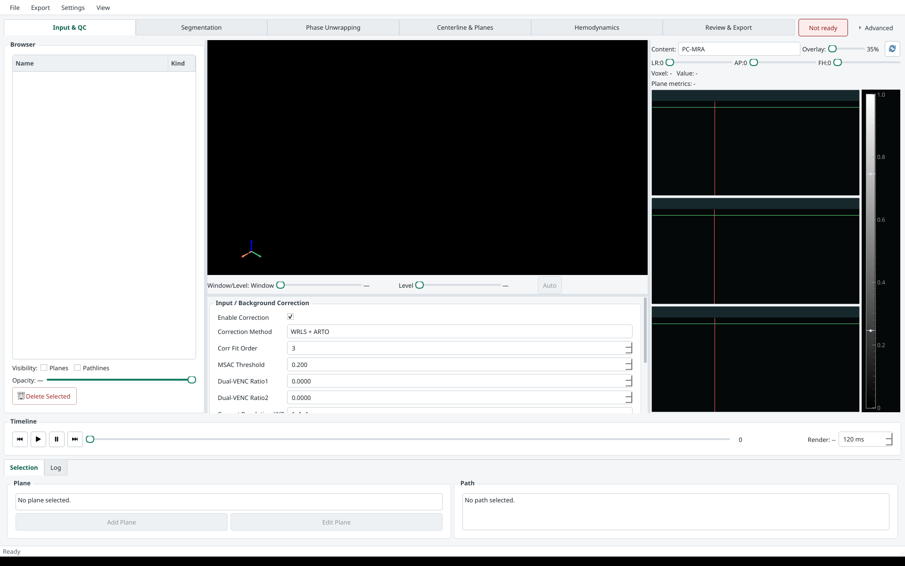

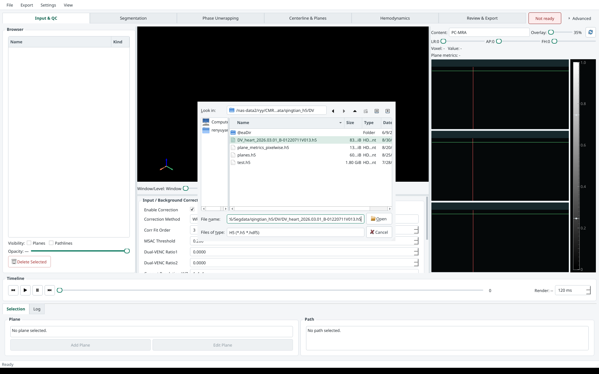

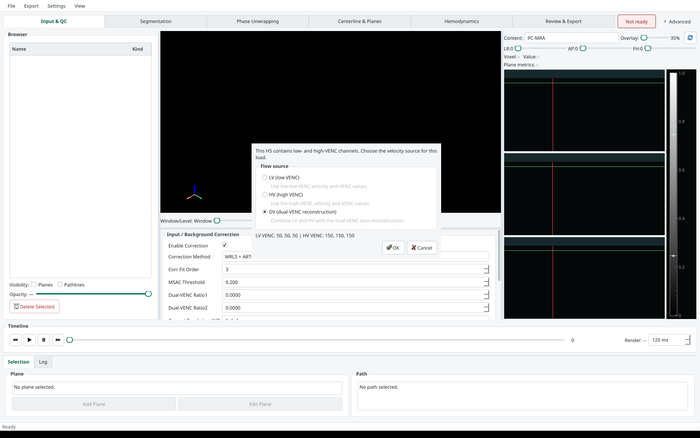

**CLI.** Inspect the H5 without reading the large image array:

    python - <<'PY'
    import h5py
    case = r"/nas-data2/ryy/CMR4DFlow2026/Segdata/qingtian_h5/DV/DV_heart_2026.03.01_B-01220711V013.h5"
    with h5py.File(case, "r") as f:
        for name, item in f.items():
            print(name, getattr(item, "shape", "group"), getattr(item, "dtype", ""))
        for name in ("Resolution", "VENC", "SpatialOrder", "VENCOrder"):
            if name in f:
                print(name, f[name][()])
    PY

The actual root keys are:

| Key | Shape and value in this case | Required for loading? |
| --- | --- | --- |
| img_complex | (144, 44, 158, 20, 7), complex64; reference plus three low-VENC and three high-VENC encodes | Yes for this legacy dual-VENC layout |
| Resolution | (3,), [2.5, 2.5, 2.5] mm | Required for calibrated geometry; missing values fall back to 1 mm |
| VENC | (6,), [50,50,50,150,150,150] cm/s | Required to decode velocity; missing values fall back to 150 cm/s |
| SpatialOrder | HF, AP, RL | Optional compatibility metadata; check axis direction |
| VENCOrder | HF, AP, RL | Optional compatibility metadata; check encoded component direction |
| corr_low | (144,44,158,1,3) float32 | Optional low-VENC correction cache |
| corr_high | (144,44,158,1,3) float32 | Optional high-VENC correction cache |
| RR | absent | Optional loader field; this run uses 1000 ms |
| Origin | absent | Optional loader field; this run uses [0,0,0] mm |
| segmentation | absent | Optional for loading; required before vessel geometry and metrics |
| sigma/TKE | absent | Optional; TKE is skipped when no valid sigma is available |

mag and flow are normalized internally from img_complex. DICOM-derived normalized H5 uses mag and flow instead; it does not need a complex reference and does not provide TKE by itself.

## 2. Load, combine dual VENC, and correct background phase

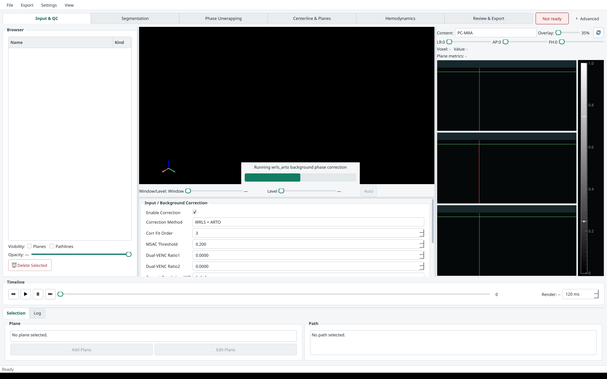

**GUI.** After choosing DV, inspect normalized fields in **Input & QC** (PC-MRA is not computed yet), then open **Correction** and click **Background Correction**. Click **Generate PC-MRA** to create its render layer. Use Run All to add noise masking and the optional unwrap stage; DV unwrap is skipped. The captured historical run used WRLS + ARTO with forced recomputation and preserved the source H5.

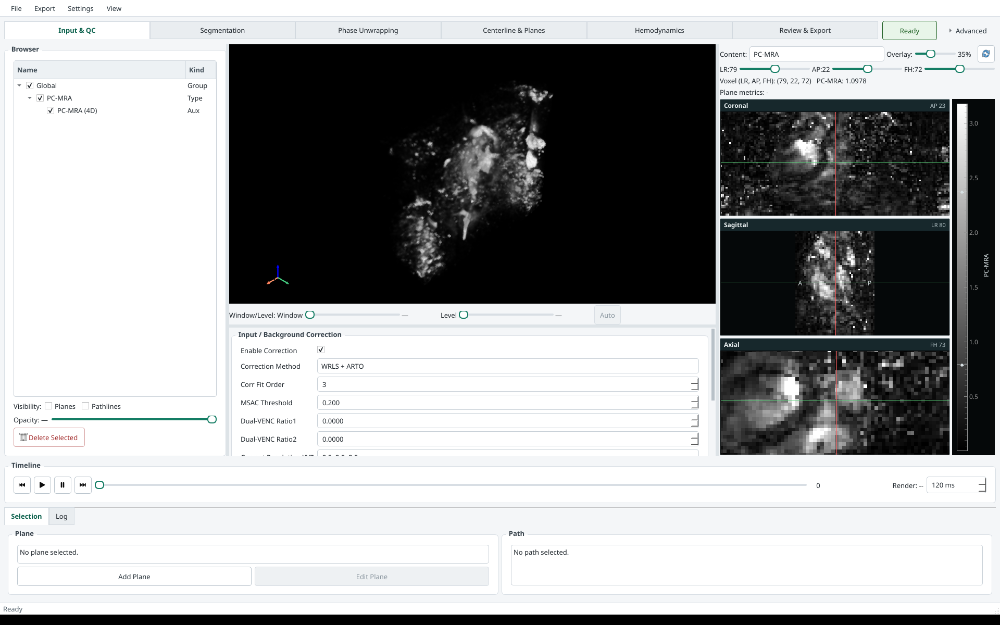

**CLI.** The equivalent load and correction command is:

    autoflow-run "$CASE" --output-dir "$OUT/load" \
      --bgc --force-recompute-corr --no-cache-write --segmentation-only

--no-cache-write prevents correction or generated segmentation from being written back into the medical H5. The canonical loaded arrays in this case are mag=(158,44,144,20) and flow=(158,44,144,20,3), with 20 phases and 2.5 mm spacing.

## 3. Generate and review segmentation

This file has no embedded segmentation, so vessel analysis cannot continue until a mask is generated or imported. The captured GUI run used the configured Dataset7020 4D nnUNet model.

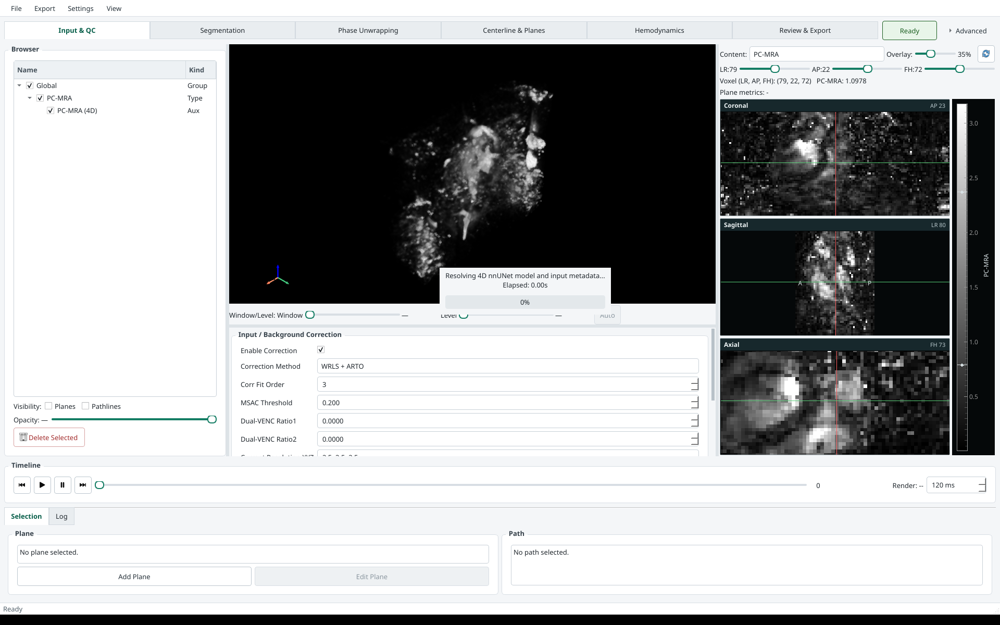

**GUI.** Open the **Segmentation** stage, set **Mode: 4D**, leave **Model preset: Automatic backend default**, and click **Run Automatic Segmentation**. Review the mask at several timeline positions, adjust labels or import a reviewed mask when needed, then use **Save...** to write a sidecar.

**CLI.** Run the same model route without modifying the source H5:

    autoflow-run "$CASE" --output-dir "$OUT/segmentation" \
      --bgc --force-recompute-corr --autoseg \
      --autoseg-backend nnUNet4D --autoseg-model auto \
      --autoseg-checkpoint auto --autoseg-folds single \
      --segmentation-only --no-cache-write

The run produced a 4D mask with shape (158,44,144,20), 16 labels and 7 connected foreground components. The generated NIfTI and the saved H5 sidecar are review artifacts, not replacements for the source file.

## 4. Optional phase unwrapping

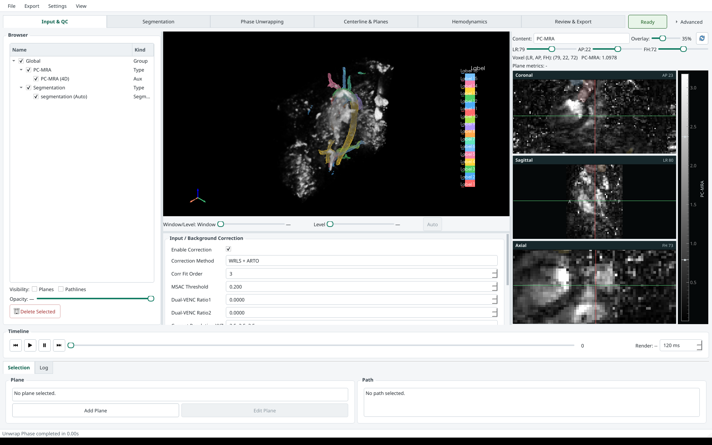

**GUI.** Choose **Correction > Phase Unwrapping > Unwrap Phase** when the input is single-VENC or when a supported method is appropriate. For this dual-VENC case the action is intentionally skipped because the dual-VENC reconstruction already resolves the selected source.

**CLI.** The matching explicit command is:

    autoflow-run "$CASE" --output-dir "$OUT/unwrap" \
      --bgc --autoseg --phase-unwrap-method none --no-cache-write

Use --phase-unwrap-method lap4D (or another supported method) only after reviewing the method and mask requirements in [phase unwrapping](../features/phase-unwrapping.md). The captured result records skipped: true, reason: dual_venc.

## 5. Generate the centerline skeleton

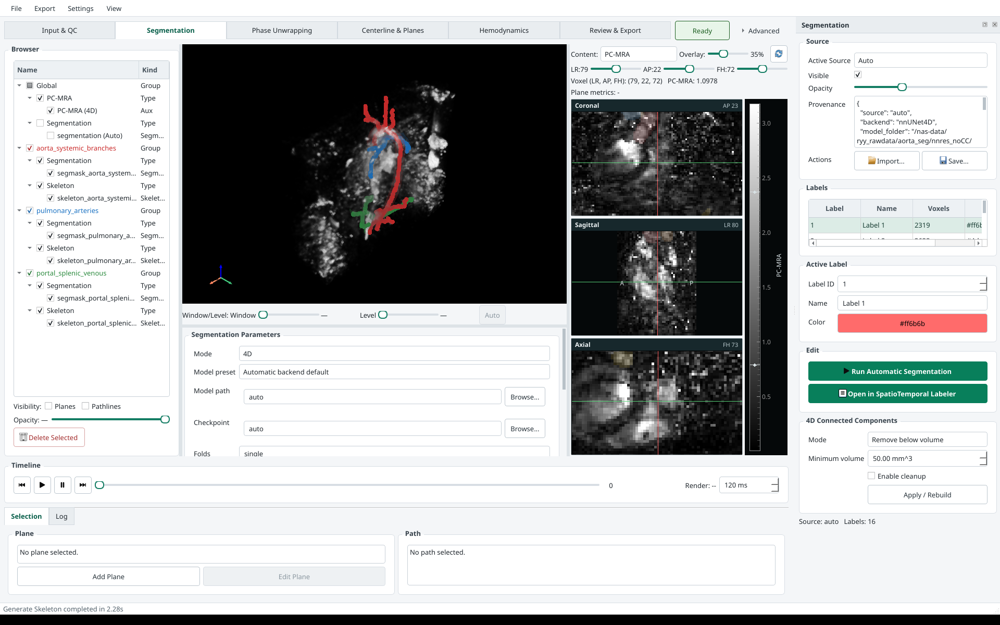

**GUI.** Choose **Centerline & Planes > Generate Skeleton**. Toggle groups in the Browser and compare the colored centerline with the segmentation and PC-MRA. **Edit Skeleton** is optional; save edits before continuing because it invalidates downstream graph and plane data.

**CLI.** There is no separate skeleton-only flag. Run the geometry part of the pipeline and skip expensive derived families:

    autoflow-run "$CASE" --output-dir "$OUT/geometry" \
      --bgc --autoseg --skip-derived --skip-plane-metrics \
      --no-cache-write

The captured GUI run generated 570 skeleton points. Missing branches, points outside the lumen, and shortcuts across touching labels must be corrected before graph generation.

## 6. Build the graph and centerline paths

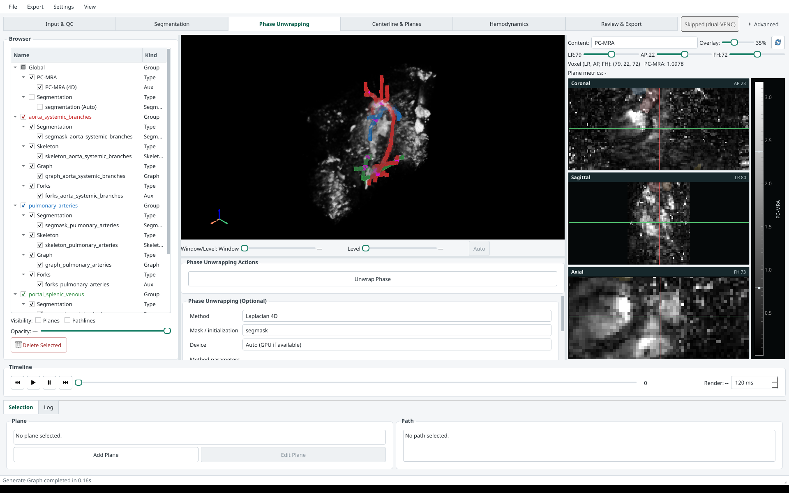

**GUI.** Click **Generate Graph**. Expand **Graph**, **Forks**, and path entries in the Browser. Use **Edit Graph** to repair a connection and save the edit; downstream paths, planes, and metrics are then rebuilt.

**CLI.** The same geometry command in step 5 builds graph topology. Read the log for node, edge, path, and fork counts.

The captured result had 569 graph nodes, 566 edges, and 37 centerline paths. The QC report later flags three disconnected components; do not treat a completed graph as proof that topology is anatomically correct.

## 7. Generate and inspect cross-section planes

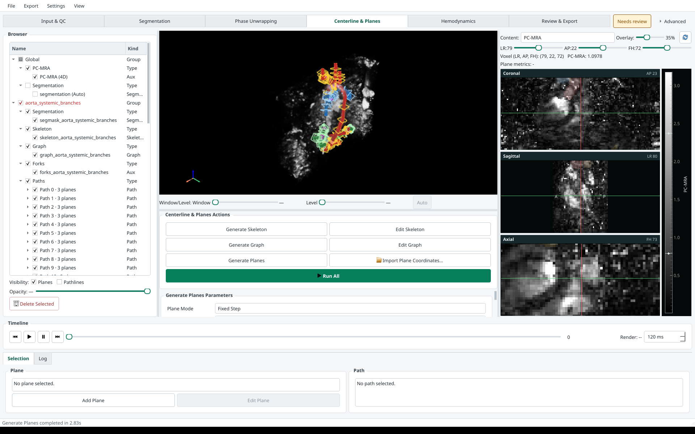

**GUI.** Choose **Generate Planes**. Select planes in the Browser and inspect the U×V, V×N, and U×N views. Use **Edit Plane** for a local adjustment and **Export > Export Plane Coordinates...** to save reviewed positions.

**CLI.** Geometry generation is included in step 5. To reuse reviewed coordinates in a later run:

    autoflow-run "$CASE" --output-dir "$OUT/reviewed-planes" \
      --bgc --autoseg --import-planes "$OUT/gui/reviewed-plane-positions.json" \
      --plane-import-mode world --no-cache-write

The captured run generated 104 planes. Review the plane normal, ownership, and contour at multiple phases before measuring flow.

## 8. Calculate plane metrics

**GUI.** Open **Hemodynamics** and click **Calculate & Save Metrics**. Select a plane, choose a curve in the Analysis dock, and use **Through-plane Flow (cm/s)** in the viewer to check the sign and alignment.

**CLI.** Plane metrics are the default hemodynamic output:

    autoflow-run "$CASE" --output-dir "$OUT/plane-metrics" \
      --bgc --autoseg --no-cache-write

This writes plane_metrics.json, plane_metrics_pixelwise.h5, and plane_qc.json. The captured run computed metrics for all 104 planes. Flow is signed by the plane normal; negative samples can be real reflux.

## 9. Compute PWV (optional and quality dependent)

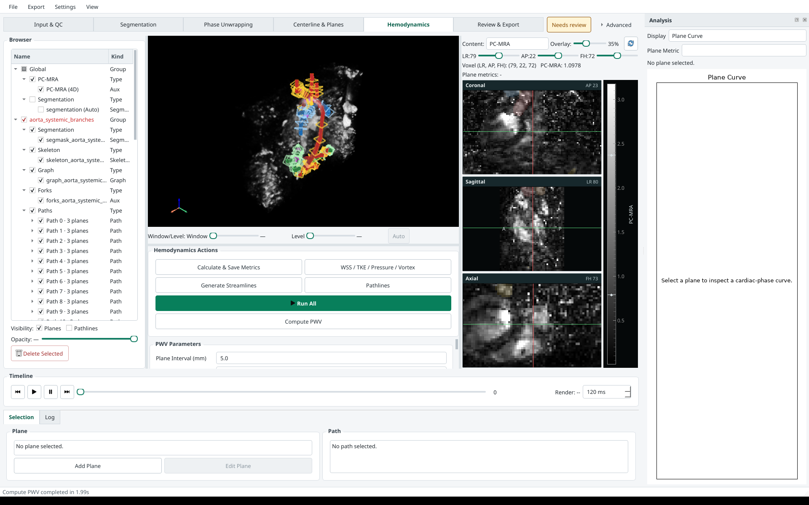

**GUI.** Configure a PWV vessel group in the Analysis dock, then click **Compute PWV**. Inspect the arrival-time curve and fit status. In this case the Portal Vein request produced a plot but the fit was marked skipped because the waveform did not meet the fit criteria.

**CLI.** Request PWV together with the normal analysis:

    autoflow-run "$CASE" --output-dir "$OUT/pwv" \
      --bgc --autoseg --with pwv --no-cache-write

Treat a failed fit as a review result. Check plane order, cycle wrapping, waveform quality, and outliers before changing thresholds.

## 10. Compute WSS, pressure, and vortex fields

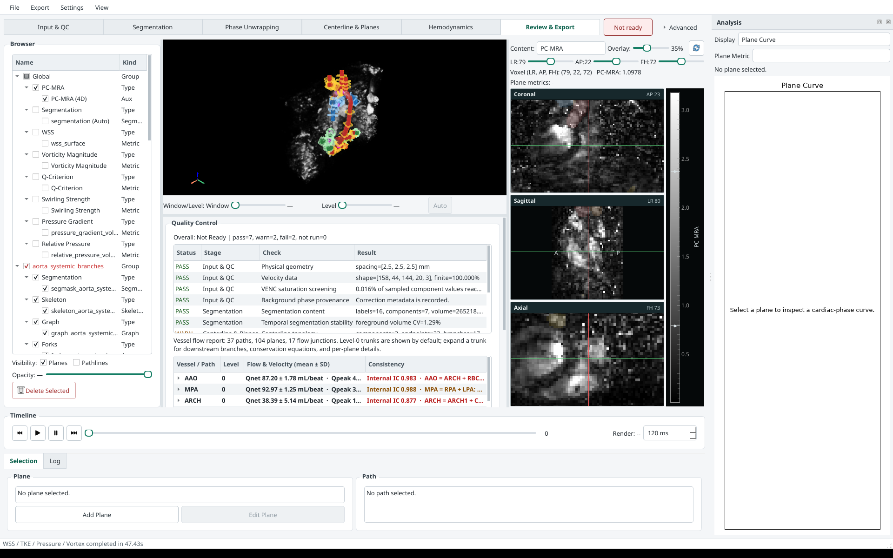

**GUI.** Click **WSS / TKE / Pressure / Vortex** in **Hemodynamics**. Toggle WSS, Pressure Gradient, Relative Pressure, and Q-Criterion in the Browser and choose each field in the Content selector.

**CLI.** Request the supported derived families explicitly:

    autoflow-run "$CASE" --output-dir "$OUT/derived" \
      --bgc --autoseg --with wss,pg,vortex --no-cache-write

The captured result populated WSS, pressure, and vortex fields. TKE stayed unavailable because this DV file has no sigma/TKE input; AutoFlow does not synthesize TKE from velocity magnitude. The CLI writes derived_metrics_pixelwise.npz and the usual summaries.

## 11. Generate streamlines and pathlines

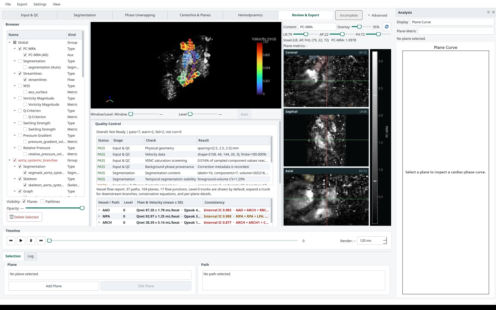

**GUI.** Click **Generate Streamlines**. Then select a plane in the Browser and click **Pathlines**; the captured run used plane 0.

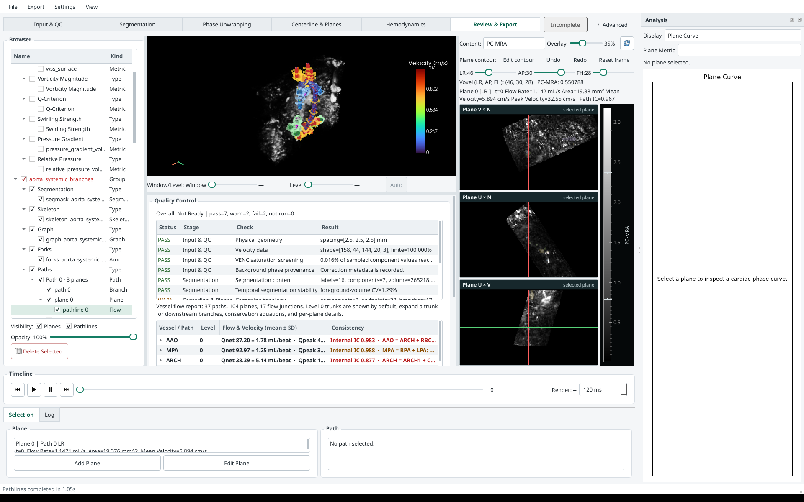

**CLI.** Streamline rendering can be requested with videos or from Python. The batch numerical command is:

    autoflow-run "$CASE" --output-dir "$OUT/flow" \
      --bgc --autoseg --with wss,pg --no-cache-write

The GUI created one plane pathline set. Pathlines are time dependent and can take substantially longer than the static streamline layer; inspect seed coverage and terminal points.

## 12. Run QC and export review artifacts

**GUI.** Choose **Review & Export**, click **Refresh Quality**, and inspect every warning or failure. Then use **Segmentation > Save...**, **Export > Export Plane Coordinates...**, and **Export > Export QC Report**.

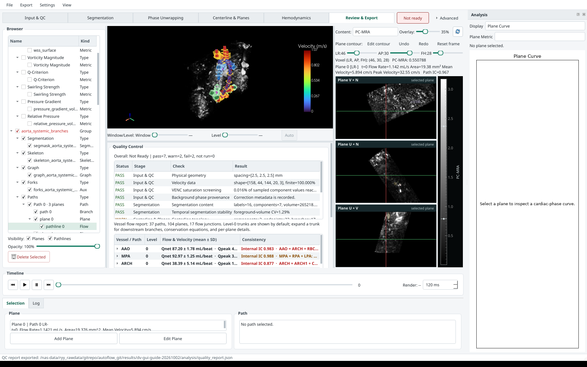

**CLI.** Export plane coordinates during a batch run:

    autoflow-run "$CASE" --output-dir "$OUT/export" \
      --bgc --autoseg --export-planes "$OUT/export/plane_positions.json" \
      --with wss,pg,vortex --no-cache-write

The GUI run wrote reviewed-segmentation.h5, reviewed-plane-positions.json, quality_report.json, plane_qc.json, planes.json, and the metric files under results/dv-gui-guide-20261002/analysis.

The captured quality report is **not ready**: 7 checks passed, 2 warned, and 2 failed. The failures are flow internal consistency and PWV fit. Inspect the disconnected centerline components, plane ownership, mask labels, and signed waveforms before using the numbers clinically.

## 13. Export videos

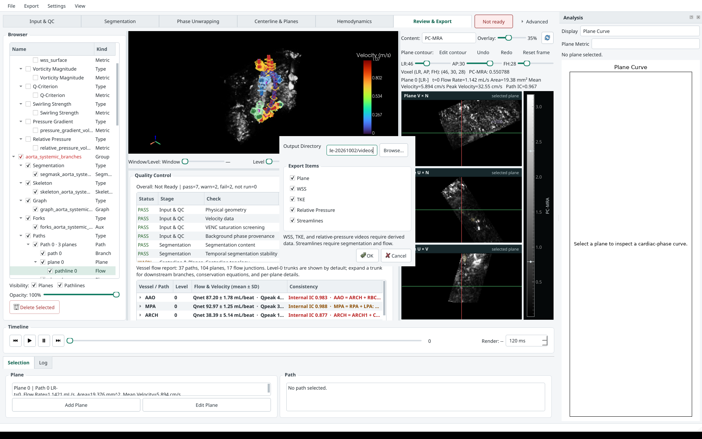

**GUI.** Choose **Export > Export Videos**, select Plane, WSS, Pressure Gradient, Relative Pressure, and Streamlines, choose an output directory, and accept. TKE is offered by the dialog but is skipped for this input because no TKE volume exists.

**CLI.** Request the same families and use a small frame count for a quick review:

    autoflow-run "$CASE" --output-dir "$OUT/videos" \
      --bgc --autoseg --with wss,pg --video plane,wss,pg,streamlines \
      --plane-rotation-frames 24 --fps 12 --no-cache-write

The captured GUI export produced planes_rotate.mp4, wss_video.mp4, pressure_gradient_video.mp4, relative_pressure_video.mp4, and streamlines_video.mp4. It did not produce a TKE video.

## 14. DICOM is another input route

The same workflow accepts a DICOM directory directly or through the optional [4DFlow_Dicom2H5 converter](../features/dicom-loading.md). The converter is pinned as the third_party/4DFlow_Dicom2H5 submodule.

    git submodule update --init third_party/4DFlow_Dicom2H5
    pip install -e ".[dicom]"

    autoflow-run /path/to/dicom --output-dir "$OUT/dicom-native" \
      --dicom-backend native --bgc --autoseg --no-cache-write

    autoflow-run /path/to/dicom --output-dir "$OUT/dicom-converted" \
      --dicom-backend dicom2h5 --dicom-h5-dir "$OUT/converted-h5" \
      --bgc --autoseg --with wss,pg --no-cache-write

In the GUI use **File > Import DICOM Directory** for native loading, or **File > Import DICOM via Dicom2H5...** to create a new H5 and then load it. Conversion never overwrites an existing destination. Converted magnitude plus velocity inputs support skeletons, graphs, planes, metrics, WSS, pressure and streamlines; TKE remains optional.

## Output checklist

| Stage | Main outputs |
| --- | --- |
| Segmentation | *_auto_segmentation.nii.gz, optional reviewed segmentation H5 |
| Centerline and planes | planes.json, planes.h5, plane position JSON |
| Plane metrics | plane_metrics.json, plane_metrics_pixelwise.h5, plane_qc.json |
| PWV | pwv.json, pwv.h5, fit plots |
| Derived fields | derived_metrics_pixelwise.npz, WSS/pressure/vortex summaries |
| Review | quality_report.json |
| Videos | planes_rotate.mp4, WSS/pressure/streamline videos when the input supports them |

For parameter definitions and API equivalents see [CLI](cli.md), [parameter reference](parameters.md), [Python API](python-api.md), and [outputs](outputs.md).
