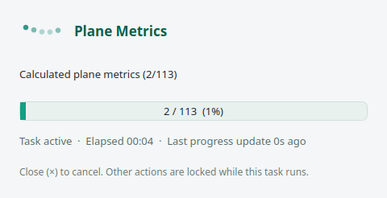

# GUI Guide

## Status
`autoflow-gui` is supported for interactive loading, segmentation review, grouped vessel processing, step execution, and visualization.

Entry files:

- `pyproject.toml`
- `autoflow/ui/launcher.py`
- `autoflow/ui/app.py`
- `autoflow/ui/remote_plotter.py`
- `autoflow/ui/theme.py`

The desktop GUI uses PySide6. The three orthogonal slice views and the manual segmentation editor use pyqtgraph; analysis plots use Matplotlib.

## Start The GUI

```bash
autoflow-gui
```

On Windows, a packaged release can be started directly with `AutoFlow-GUI.exe`. The standalone build includes the GUI dependencies, nnUNet inference runtime, `dataset.json`, `plans.json`, and `fold_all/checkpoint_final.pth`; it does not require a Python installation or a separate model directory. The single-file build extracts its runtime to a temporary directory at startup, so its first launch is slower than the installed Python entry point.

Or load defaults from a custom config directory:

```bash
autoflow-gui --config-dir ./configs
```

For a regular forwarded SSH session, connect with trusted X11 forwarding and
start the same command:

```bash
ssh -Y <host>
autoflow-gui
```

When `DISPLAY` has the forwarded `localhost:N.0` form, AutoFlow automatically
renders VTK through off-screen EGL and transfers the completed 3D image into a
normal Qt widget. Startup probes EGL in a separate process and falls back to
software rendering if it is unavailable. A pre-set `VTK_DEFAULT_OPENGL_WINDOW`
is respected; use `VTK_DEFAULT_OPENGL_WINDOW=vtkOSOpenGLRenderWindow autoflow-gui`
to force the software path when diagnosing driver problems.
In the 3-D view, VTK's default trackball-camera mapping is
used: left-drag rotates, middle-drag pans, right-drag performs dolly/zoom, and
the mouse wheel zooms. When PC-MRA is visible, `Shift`+left-drag adjusts its
window/level. Existing 3D picking and edit controls remain available. A local
display such as `DISPLAY=:1` continues to use the native embedded VTK
widget. SSH rendering affects display latency only; loaded arrays, processing,
and saved numerical results are identical.

## Main Layout

The main window contains:

- menu bar
- workflow navigation for `Input & QC`, `Correction`, `Segmentation`, `Centerline & Planes`, `Hemodynamics`, and `Review & Export`
- left browser
- central 3D view
- steps area
- parameter panels
- right ortho viewer
- bottom timeline
- bottom `Selection` and `Log` tabs
- right segmentation dock
- right analysis dock

The GUI uses a shared light workbench theme across the main window, dialogs, tables, parameter panels, and docks. The timeline uses fixed-size previous, play, pause, and next icons; hover each icon for its action name. Its `ms` value is the requested delay between frames, not the acquisition time resolution. While playback runs, the timeline reports a rolling scene-and-slice render time plus the effective FPS. When render time exceeds the requested delay, playback runs at the fastest rate the visible scene can sustain. Selection details and the runtime log share a compact bottom tab area so the 3D and ortho views retain more vertical space.

The loaded arrays are already normalized to `LR/AP/FH`. The 3D orientation axes, ortho sliders, flow-component names, pressure-gradient component names, and slice titles use those physical direction labels instead of generic `X/Y/Z`. The source file's original `SpatialOrder` remains visible in the input settings and metadata for auditing, but it is not reused to label arrays after normalization. The top-level `Settings > 3D Axis Orientation` action can apply a display-only reversal of the X/Y/Z positive directions (for example `LR` to `RL`); all rendered 3D objects are mirrored together while internal arrays and analysis coordinates remain unchanged.

The left browser is group-aware and path-aware. When the loaded segmentation produces multiple vessel groups, the browser shows one top-level section per group. Path geometry, generated planes, and their pathlines are organized as `Paths -> Path -> Plane -> Pathline`; each path row shows its plane count. Manual or unmatched planes appear under `Unbound Planes`. Group, path, and plane checkboxes control all descendants, while selecting a path or plane updates the corresponding 3D highlight and analysis panel. Use Ctrl/Shift selection with a plane context menu to launch pathlines for that subset; the main `Pathlines` action runs all planes.

After **Correction > Generate PC-MRA**, `Global → PC-MRA (4D)` is available as a
grayscale VTK volume backdrop. It is phase-resolved (`magnitude_t × speed_t`)
and updates with the timeline/playback, with a low-intensity transfer function
to suppress background noise. The volume uses GPU rendering when supported,
with a CPU mapper for the software SSH fallback. Cached cardiac frames share
one volume actor; phase changes update its input and transfer functions instead
of removing and recreating it. Each timeline update draws the completed scene
once. A static 3-D magnitude volume is reused for every velocity frame.
The default volume color transfer is grayscale
with white high intensities, and the default 3-D background is black. Select any Browser object to adjust its
individual `Opacity` with the slider below the tree; the context menu also has
`Set Opacity…` and `Reset Opacity (100%)`. Selecting a group applies the slider
to all of its descendants. The `Visibility: Planes` and `Visibility: Pathlines`
switches below the tree toggle every object of the selected type at once and
show a mixed state when only some are visible. Clicking a mixed switch shows
all objects; clicking a checked switch hides them. A switch is disabled only
when its category has no objects. Visibility changes preserve the Browser
selection and expansion, and hiding a selected plane also hides its highlight.
`Display size` and `Only selected plane` sit directly below `Opacity` in the same
Browser control area. The right-hand ortho viewer has a separate
`Overlay` slider for the 2-D segmentation overlay; it does not change the
underlying scalar window/level.

The 3-D view supports a combined review of PC-MRA, segmentation, and planes.
After label-group preprocessing, the aggregate segmentation surface is hidden
so it is not drawn twice; the label-group surfaces are shown at 15% opacity by
default. Plane surfaces are rendered as bright unlit wireframes so they remain
readable over the PC-MRA volume. Selecting a plane in the Browser adds a
magenta highlight; if all planes are too dense, hide individual plane entries
or use the group/path checkboxes.

When `PC-MRA (4D)` is visible, hold `Shift` and the central 3-D view's left
mouse button, then drag horizontally for window width and vertically for window
level. The Browser context menu's `Reset PC-MRA Window/Level` restores the
automatic current-frame range. Without `Shift`, the default left-drag rotation and
middle-drag pan remain unchanged.

The `Window/Level` control bar below the 3-D view provides `Window` and `Level`
sliders for the selected scalar scene object. It works for PC-MRA, WSS, TKE,
pressure-gradient layers, and streamline objects; `Auto` restores that object's
automatic range. The `Overlay` opacity slider is independent and controls the
2-D segmentation overlay directly.

On SSH-forwarded X11, `autoflow-gui` automatically selects the off-screen
rendering widget and transfers the rendered image into the Qt window. The
terminal remains occupied while the GUI is open; close the AutoFlow window or
press `Ctrl+C` to end the process.

The workflow navigation filters actions and parameters to the active task. Everyday controls remain visible; advanced skeleton, WSS, and pressure parameters are hidden until `Advanced` is enabled, while vortex controls remain visible in Hemodynamics. In `Hemodynamics`, plane metrics, derived metrics, live streamlines, and pathlines form a 2x2 action grid; `Run All` and `Compute PWV` are full-width rows below it. The segmentation dock appears only in the Segmentation stage, and the Analysis dock appears in Hemodynamics and Review. The status beside the navigation reports `Ready`, `Needs review`, `Incomplete`, or `Not ready` from current workspace prerequisites.

Input also provides `Reload Input with Current Parameters`. An unchanged input signature is skipped; changed geometry, VENC, dual-VENC ratios reload the source and invalidate downstream artifacts. Opening or reloading H5 applies its existing `corr` (or dual-VENC `corr_low` / `corr_high`) when valid for the selected case, without fitting a missing cache. Correction settings live in **Correction**; clicking **Background Correction** or **Run All** always recomputes from the original acquisition and replaces the previous correction. Background correction and unwrapping update working velocity while retaining existing downstream artifacts until manually rerun. Corr content becomes available only after correction is applied or reused.

## File Menu

| Menu item | What it does | Main code |
| --- | --- | --- |
| `Load H5` | open an H5 or HDF5 case; prompts for a data-group path when one file contains multiple supported cases, asks for `LV`, `HV`, or `DV` for legacy dual-VENC data, then loads acquisition data, any embedded segmentation and existing correction fields; manual Correction actions recompute from the original source | `autoflow/ui/app.py`, `autoflow/ui/input_dialogs.py` |
| `Load DICOM` | the single DICOM loading action, directly below `Load H5`; convert to a new reusable H5 in a background worker, validate it, select a group if needed, and load it | `autoflow/ui/app.py`, `autoflow/algorithms/dicom_conversion.py`, `autoflow/ui/input_dialogs.py` |
| `Clear Workspace` | clear loaded data and restore config defaults in the UI | `autoflow/ui/app.py` |
| `Exit` | close the GUI | `autoflow/ui/app.py` |

## Export Menu

| Menu item | What it does | Main code |
| --- | --- | --- |
| `Export Videos...` | choose an output directory and export selected plane, WSS, TKE, pressure-analysis, or streamline videos | `autoflow/ui/app.py`, `autoflow/rendering/videos.py` |
| `Export Plane Coordinates...` | export selected Browser planes, or all planes when none are selected | `autoflow/ui/app.py`, `autoflow/plane_io.py` |
| `Export QC Report...` | write the current staged automated quality report | `autoflow/ui/app.py`, `autoflow/quality.py` |

The 3-D viewer and exported movies share matte vessel lighting, antialiased edges and unlit metric colours. WSS uses `turbo`, TKE `inferno`, velocity `turbo`, pressure gradient `magma` and relative pressure `RdBu_r`. Missing WSS samples appear as transparent gaps instead of gray patches or artificial zero values. Video export uses current metric colormap, opacity, colour limits and shared colourbar layout. CLI movies have the same default style when using the same JSON bundle.

## Settings Menu

| Menu item | What it does | Main code |
| --- | --- | --- |
| `3D Axis Orientation...` | choose the displayed positive direction for each 3D axis; the scene mirrors around its center while internal data remains unchanged | `autoflow/ui/app.py`, `autoflow/ui/viewer.py` |
| `3D Background Color...` | choose the 3-D viewport background color; the choice applies to surfaces and PC-MRA volume rendering and starts from `ui.background_color` (`#101820` by default); the current session background is also used by video exports | `autoflow/config.py`, `autoflow/ui/app.py`, `autoflow/ui/viewer.py` |
| `Ortho Viewer Display...` | set the initial three-view zoom and plane-contour smoothing | `autoflow/ui/ortho_viewer.py`, `autoflow/ui/slice_view.py` |

## Standard Workflow

1. start the GUI
2. load through `File > Load H5` or `File > Load DICOM`; select `LV`, `HV` or `DV` for legacy dual-VENC H5
3. inspect inputs in `Input & QC`; H5 loads embedded segmentation and applies existing correction fields when available; the load progress dialog shows loading and applying saved corr, separately for low/high VENC
4. for DICOM, choose a new H5 destination and review the converted acquisition calibration
5. to recompute correction, open `Correction`, configure background correction and noise masking, then click `Run All` for Background Correction → Noise Removal → Unwrap Phase → Generate PC-MRA (default `lap4D`, mask `none`)
6. in the `Segmentation` workflow stage, configure nnUNet if needed and click `Run Automatic Segmentation` explicitly
7. after segmentation, optionally return to `Correction > Phase Unwrapping`, choose a method and `segmask` for masked refinement, and click `Unwrap Phase`; existing downstream results stay available until manually rerun
8. if phase unwrapping ran, inspect `Estimated Wrap Locations`, `Phase Wrap Count`, and the `Unwrapped − Wrapped` views to see where wraps were detected
9. if the segmentation is a label mask, AutoFlow will reduce 4D labels to 3D by time majority vote, remove small connected components per label, merge labels by configured groups, filter grouped components with the configured skeleton cleanup rule, and then run grouped skeleton, graph, and plane generation
10. move through the workflow stages and run the actions shown for the current stage; `Run All` is limited to the active stage
11. inspect group sections in the browser, 3D view, ortho viewer, and selection panel
12. select a plane to replace the standard slices automatically with `U × V`, `V × N`, and `U × N` views centered on `Plane.center`; the first view is the plane itself and shows the segmentation overlay plus the cyan metric-ROI contour. The `Content` menu then enables `Through-plane Flow (cm/s)`, projected onto the selected plane normal. Clearing the plane selection restores the standard axial, coronal, and sagittal views. Scalar slices use linear interpolation and labels use nearest-neighbour sampling. The three viewers choose robust per-slice window/level values, start with the configured view-only zoom, and use right-click to zoom back out without cropping the data
13. select `Edit contour` to use the CVI-style freehand editor on the `U × V` view: draw a closed stroke for a new contour, or draw a stroke that crosses an existing contour to replace one local boundary segment. Endpoints snap to the old boundary, the stroke is smoothed, and the area grows or shrinks from the drawn route without an add/remove mode. The edit is committed to the current frame only and recomputes only that frame's plane metrics; TKE, WSS, pressure, and other derived volumes remain unchanged. Ambiguous joins, multiple crossings, or self-intersections are rejected. Use `Undo`, `Redo`, and `Reset frame` for repeated edits
14. click `Pathlines` to generate all planes by default, or use a plane context menu to choose This Plane or Selected Planes; generated planes accumulate, and requesting an existing single-plane pathline selects it instead of integrating it again
15. open `Review & Export`, refresh QC, inspect warnings and suggested actions, expand the vessel flow tree from level-0 trunks to branches and planes, then export the report when needed
16. open the top-level `Settings > 3D Axis Orientation` action to reverse any displayed positive axis direction (LR/RL, AP/PA, or FH/HF) when the case's viewing convention requires it
17. use `Export > Export Videos...` when you want selected offline MP4 exports
18. save the active segmentation if you want to reuse it later

## Step Buttons

| Step | Purpose | Notes |
| --- | --- | --- |
| `Generate Skeleton` | skeletonize the active segmentation | binary masks run as one group; label masks run per configured group |
| `Generate Graph` | build graph, branches, and paths | depends on skeleton and preserves group names |
| `Generate Planes` | create uniform or fixed-step planes with anchor, direction, and distance/fraction spacing | defaults to center/both/3/25%; segmentation filter is enabled and QC records actual counts |
| `Calculate && Save Metrics` | compute and save basic plane flow, area, and velocity metrics; reuse derived fields only when they already exist | requires segmentation and flow; it does not implicitly start WSS/TKE/pressure computation |
| `WSS / TKE / Pressure / Vortex` | compute missing derived families, add supported derived summaries to existing plane metrics, and refresh scene objects | TKE stays optional; vortex fields are whole-volume only; cached families are not recomputed |
| `Generate Streamlines` | enable live streamlines from the combined segmentation | requires segmentation |
| `Pathlines` | launch time-resolved pathlines for all planes by default | runs in the same Qt background-worker/progress-dialog pattern as automatic segmentation; use the plane context menu for This Plane or Selected Planes. Existing plane pathlines are preserved and skipped; a repeated single-plane request selects its existing Browser object. Particles are released once at `t=0`; playback reveals their cached trajectory prefix at each later phase without re-running VTK. `Fixed Count` seeds default to `250`; use `Ratio` for area-dependent density. Pathline-only controls, including seed settings, tube radius, colors, and temporal cache, load from `configs/pathlines.json`; live streamline settings remain in `configs/streamlines.json`. |
| `Import Plane Coordinates...` | import v2 or legacy plane JSON beside `Generate Planes` using world, local, or relative-centerline mapping | available in Centerline & Planes |
| `Edit Skeleton` | enter a dedicated skeleton edit mode | select a group object in the browser to edit that vessel directly; otherwise choose a vessel group in the dialog. The scene hides unrelated layers; select and drag points, use Delete/Backspace to remove, then use `Save Changes`, `Cancel`, or Esc |
| `Edit Graph` | enter a dedicated graph edit mode | select a group object in the browser to edit that vessel directly; otherwise choose a vessel group in the dialog. The scene hides unrelated layers; select/drag nodes, select/delete edges, press E or use Edge Mode to add/remove edges, then save or cancel |
| `Run All` | in `Centerline & Planes`, run skeleton, graph, and planes; in `Hemodynamics`, run plane metrics, derived metrics, live streamlines, and all-plane pathlines | does not create segmentation automatically; `Compute PWV` remains explicit |

Compute-oriented pipeline buttons execute in Qt workers. Plane metric progress advances once for each completed plane, and pathline integration also runs in its own worker before the GUI creates its VTK scene actors, so slow integration does not block the application window. The progress dialog remains responsive while algorithms run. The Browser `Planes` and `Pathlines` visibility switches show or hide every object of that type at once; a partially checked switch indicates mixed visibility. After completion, the GUI invalidates and rebuilds only scene objects affected by those steps instead of recreating every VTK actor. Closing the window is blocked while a task is active so the workspace cannot be destroyed during a calculation.

`Parallel Plane Metrics` keeps small plane-phase workloads serial. Below 128
planes, at least 1920 plane-phase evaluations use up to four processes; jobs
with at least 128 planes retain up to eight isolated worker processes. The process isolation is
required because VTK slicing is not safe against concurrent access to shared
datasets. Progress still advances once per completed plane.

`Run All` scope:

1. `Correction`: `Background Correction` → `Noise Removal` → `Unwrap Phase` → `Generate PC-MRA`. Default `lap4D` uses no mask. Noise masking changes the 3D PC-MRA region and can optionally be reviewed as a red ortho overlay; the other two stages update working velocity. Existing downstream results are kept until manually rerun.
2. `Centerline & Planes`: `Generate Skeleton` -> `Generate Graph` -> `Generate Planes`
3. `Hemodynamics`: `Calculate && Save Metrics` -> `WSS / TKE / Pressure / Vortex` -> `Generate Streamlines` -> `Pathlines` for every plane. The metric stages run in a background worker; streamlines are then added to the live scene and pathline integration runs in its own worker.

## Parameter Panels

| Panel | Main purpose | Main code |
| --- | --- | --- |
| `Input Parameters` | input geometry and calibration; explicit reload | `autoflow/ui/app.py`, `autoflow/config.py` |
| `Background Correction` | Correction action settings: `MSAC` or `WRLS + ARTO`, fit order and dual-VENC ratios | `autoflow/ui/app.py`, `autoflow/core/pipeline.py` |
| `Noise Removal (PC-MRA Rendering Only)` | magnitude and temporal velocity SD display filter, plus reset | `autoflow/ui/app.py`, `autoflow/algorithms/noise_removal.py` |
| `Segmentation Parameters` | choose 3D or 4D automatic segmentation and configure its model path, checkpoint, folds, device, and label map | `autoflow/ui/app.py`, `autoflow/core/models.py`, `autoflow/algorithms/segmentation/nnunet_static.py` |
| `Generate Skeleton Parameters` | cleanup and morphology controls, including `Special Handling`, `Minimum Edge Count`, and the `Separate Special Label Contacts` switch for `RBCT`/`CCA`/`LBCT` contacts | `autoflow/ui/app.py`, `autoflow/config.py`, `autoflow/algorithms/graph.py` |
| `Generate Planes Parameters` | uniform/fixed-step layout, segmentation filter, and advanced trim controls | `autoflow/ui/app.py` |
| `PWV Parameters` | edit groups, waveform selection, spacing, and plot styling | `autoflow/ui/app.py` |
| `Streamline Parameters` | seed density, steps, terminal speed, colors | `autoflow/ui/app.py` |
| `WSS Parameters` | WSS-specific controls plus runtime render and shared colorbar controls for live scalar layers, including width, height, position, and font sizes | `autoflow/ui/app.py` |
| `Flow / TKE / Pressure Parameters` | WSS, TKE, and pressure controls; shown with `Advanced` | `autoflow/ui/app.py` |
| `Vortex Kinematics Parameters` | Gaussian smoothing and support-erosion controls; visible in Hemodynamics by default | `autoflow/ui/app.py` |

After `WSS / TKE / Pressure / Vortex` completes, the ortho viewer `Content` menu provides `Vorticity Magnitude (s⁻¹)`, `Q-Criterion (s⁻²)`, and `Swirling Strength λci (s⁻¹)`. `Vortex Support Erosion (vox)` defaults to `1`; it only limits the valid derivative region and does not alter the segmentation.

The correction-method dropdown defaults to `WRLS + ARTO`. Choosing `MSAC` enables the MSAC-only threshold control; WRLS tuning values continue to come from `configs/loader.json`. CUDA use inside WRLS+ARTO is automatic and has no GUI device selector.

## Segmentation Workflow

The GUI segmentation system supports:

- original segmentation
- imported segmentation
- automatic segmentation through `nnUNet` (3D) or `nnUNet4D` (4D)
- external segmentation editing through the optional SpatioTemporal Labeler

Threshold segmentation remains available to the non-GUI API and CLI compatibility
paths; it is not exposed as a GUI segmentation mode.

Important behavior:

- `Run All` does not auto-start segmentation
- segmentation must already exist when segmentation-dependent steps run
- opening H5 loads the selected acquisition group and any embedded `segmask`, `segmentation` or `seg`, and applies existing correction fields; it never fits a missing correction cache
- background correction settings are in Correction; there are no correction configuration prompts during input loading
- input loading never starts or asks to start automatic segmentation
- the top menu bar has no separate `Segmentation` menu; generation settings and commands are in the `Segmentation` workflow parameter panel, while source review and editing remain in the right-side `Segmentation` dock
- use the `Segmentation Parameters` panel to choose `3D` or `4D`, choose a detected local model preset or browse to a custom model folder, and set checkpoint, folds, device, and label map; click `Run Automatic Segmentation`. The right-side dock keeps active-source review, import, save, visibility, and label-editing controls
- an input case's embedded segmentation is activated during loading; click `Run Automatic Segmentation` only when you want to replace it with a new model result
- `Open in SpatioTemporal Labeler` is available when the optional `labeler` extra is installed; it exports `mag`, three flow components, `pcmra`, and the active segmentation as NIfTI files through a separate editor process
- the shipped automatic-segmentation settings default to the local Dataset7020 `nnUNet4D` profile (with the orchestration script as fallback); enter a static model folder and select `nnUNet` when a 3D model is required
- GUI auto segmentation uses the same application-modal progress dialog as other long-running GUI tasks; nnUNet inference runs in an isolated child process so native CUDA/nnUNet failures are reported in the dialog instead of terminating the Qt GUI. × requests cancellation and stops the inference child process; the dialog remains visible until the task stops, cancelled results are not applied, and failures open an error dialog after the progress lock is released
- automatic segmentation saves a sidecar H5 file after a successful run
- automatic segmentation also saves the predicted segmentation NIfTI plus the feature-channel NIfTI inputs used for that run
- the Labeler export dialog advances as the six background exports finish; unchanged images are reused, and changing the active segmentation refreshes only the label file. Files remain uncompressed `.nii`
- save the original `segmentation.nii` in Labeler with `Ctrl+S`; after Labeler exits, AutoFlow detects the changed file and offers to apply it as the `imported` source, preserving the embedded original
- optional 4D connected-component cleanup removes components below a physical volume or keeps the largest component per label and frame

Grouped label-mask behavior:

- binary masks and single-label masks are treated as one group
- 4D label masks are reduced to 3D labels by majority vote along time before vessel steps run
- connected-component cleanup runs per label value before labels are merged into groups
- grouped vessel masks use the skeleton connected-component filter mode; the default `hybrid` rule keeps every component above `max(min_cc_volume_mm3, cc_rel_min_ratio * largest_component_volume_mm3)`
- label grouping, browser colors, and per-group preprocessing come from `configs/labels.json`
- each group can apply its own Gaussian smoothing and morphology overrides before skeletonization

PWV behavior:

- the `PWV Parameters` panel exposes groups, waveform key, spacing, transit-time method, foot definition, cross-correlation window, cross-correlation interpolation factor, cycle-wrap correction, smoothing, minimum valid planes, and plot colors. The GUI always runs PWV when `Compute PWV` is clicked; there is no enable checkbox. The default foot-to-foot waveform is `flowrate_mL_s`
- when `Allow Cycle Wrap` is enabled, foot detection can follow an upstroke that starts at the end of the cardiac cycle and peaks in the first frames instead of pinning those planes to `0 ms`
- group labels can be entered as symbolic names from `configs/labels.json` such as `AAO, ARCH, DAO` or as integer ids
- step buttons use the current GUI PWV values immediately after `Load`, `Clear Workspace`, or manual edits; the values do not write back to `configs/pwv.json` automatically
- the GUI shows one `Analysis` dock with a `Display` selector. `PWV` keeps the group selector and two-panel PWV plot. `Plane Curve` shows the selected plane's chosen metric across cardiac phase, including pressure-gradient and relative-pressure series when available. `Centerline Pressure` shows the selected path's current relative-pressure profile plus its per-phase pressure drop. `Internal Consistency` shows the selected path or plane's path-level and branch-level internal consistency
- `Review & Export -> Quality Control` has two coordinated views: the staged check table and a vessel flow report. The flow report initially shows only level-0 trunks such as `AAO` and `PV`. Expanding a trunk shows flow-ordered child paths (`PV1`, `PV2`, `PV1-1`, ...), each path's mean ± SD flow/velocity summary and internal consistency, label-named junction conservation such as `SMV + SV = PV`, and an expandable `Planes` row with individual measurements
- PWV planes appear in the browser as one grouped item named `PWV planes`; the GUI does not list every PWV plane separately


## Video Export

Use `Export > Export Videos...` for interactive offline export.

- choose an output directory
- select any combination of `plane`, `wss`, `tke`, `pg`, and `streamlines`
- `plane` is checked by default
- WSS, TKE, pressure-gradient, and relative-pressure exports compute missing derived data before rendering
- GUI video export reads shared camera and sizing defaults from `configs/video_exporting.json`
- GUI live planes read `configs/planes.json -> render for GUI plane styling`
- GUI live WSS, TKE, pressure-gradient, relative-pressure, streamline, vorticity, Q-criterion, and swirling-strength objects read the corresponding render settings; the single live colorbar always uses the compact geometry and fonts from `configs/colorbar.json`, while per-metric `bar_cfg` remains the offline-video default
- streamline `clim` defaults to `auto`, which uses `0` to the P99 finite velocity inside the segmentation across all phases so isolated dual-VENC outliers do not flatten the useful range; enter two numeric limits for a fixed range, or enter `auto` in both fields to restore automatic scaling
- pressure-gradient and relative-pressure 3D layers are rendered on a smoothed pressure support surface
- the GUI keeps one shared scene colorbar for segmentation labels, WSS, TKE, pressure-gradient, relative-pressure, streamlines, vorticity, Q-criterion, and swirling strength; when you show or hide one of these layers, the colorbar is rebuilt for the active visible scalar layer instead of stacking multiple bars
- segmentation uses a categorical colorbar containing only label values present in the rendered surface, with label names instead of interpolated decimal ticks
- after loading into an empty 3D scene, the camera resets once to the first visible actor bounds; later time changes and scene-property edits preserve the current camera
- if `summary.json` already exists in the output directory, the GUI updates `videos`, `video_times_sec`, and adds `gui_video_export`

`Run All` does not export videos automatically. Video export is a separate top-level menu action.

## Selection, Browser, And Timeline

Below the Browser tree, beside the `Visibility` and `Opacity` controls, use the live `Display size` slider and mm input (1–200 mm, initially 10 mm) plus `Only selected plane`. Reduce the size for densely spaced branches, or enable the filter and select planes in the Browser one at a time. These controls affect outlines, highlights, and their picking region without regenerating planes or recalculating metrics. The bottom `Plane` information box contains selection details and `Add Plane` / `Edit Plane` actions.

Regenerating a skeleton clears the old graph and plane layout; regenerating a graph clears the old planes; generating planes replaces the full old layout. Their plane measurements, PWV, pathlines, selection highlights, and edit handles are cleared. The 3D view removes actors from both the main scene and the plane foreground layer. `View > Toggle Axes` changes the corner orientation marker without recreating models or moving the camera.

- the browser creates one top-level row per segmentation group and one `Global` row for non-grouped scene objects
- generated planes are grouped by their `path_index` under `Paths`; each path contains its path geometry, planes sorted by path distance, and any generated pathline below its plane
- manually added planes (`path_index=-1`) and planes whose path cannot be resolved stay under `Unbound Planes`
- after vortex metrics are computed, the `Global` row includes `Vorticity Magnitude`, `Q-Criterion`, and `Swirling Strength` metric objects; each can be toggled independently
- the default layout gives the browser more width and reserves most of it for `Name`; `Kind` is a fixed narrow column with the complete type available as a tooltip, and visibility is controlled by the checkbox beside each name rather than a separate empty column
- checking or unchecking a group row shows or hides every object in that group; `Paths`, an individual `Path`, or a `Plane` row applies the same operation to its descendants
- right-clicking a `Path` offers show/hide for its contents and `Generate Pathlines for This Path`; right-clicking a `Plane` retains the single-plane and selected-plane pathline actions
- group title colors use `label_groups.<group>.browser_color` from `configs/labels.json`, with fallback colors for unmatched or single-label cases
- grouped objects keep stable internal data keys such as `smooth_path_aorta_systemic_branches_3`, `plane_aorta_systemic_branches_5`, and `pathline_aorta_systemic_branches_5`; the Browser uses `(group_name, path_index)` to present their relationship without changing those keys
- browser-visible names are intentionally shorter, for example `path 3`, `plane 5`, and `pathline 5`
- right-clicking an individual grouped pathline in the browser opens `Set Pathline Color`, which changes only that pathline
- selecting a plane updates selection info, the ortho viewer, and the `Analysis` plane/path views
- selecting a path shows its segmentation owner in the lower-right `Path` panel (for example, `label=LBCT (id=7)`); this is the label selected by the segmentation filter and does not rename or edit the graph path
- the right-side dock initially shows `Segmentation`; its first `Source` section provides active-source switching, visibility, opacity, provenance, import, and save controls. Segmentation generation settings live in the workflow parameter panel
- `Analysis` initially uses `Plane Curve`, so selecting a plane immediately exposes its available time-resolved metric series
- `Add Plane` creates a free plane at the current ortho cursor; it can be moved anywhere and is saved with `placement_mode=manual`, so reuse does not project it onto a path
- `Edit Plane` enables a cyan center handle plus orange and yellow in-plane-axis handles; generated plane centers remain constrained to their path, while manual plane centers are unrestricted
- dragging either colored axis endpoint rotates the plane directly in the 3D view; there are no numeric `Rotate U` or `Rotate V` fields
- plane actors update during the drag, while ortho refresh, pathline regeneration, metric computation, and file writes wait until the interaction finishes
- releasing a plane handle recomputes only that plane and never starts missing WSS/TKE/pressure work; it updates the metric and plane JSON/H5 records, while the full pixelwise H5 is regenerated by `Calculate && Save Metrics`
- selecting a path shows path-level information and updates `Analysis -> Internal Consistency`
- the timeline controls time-resolved scene objects and ortho slices
- the timeline redraws 3D and ortho data while dragging, coalescing rapid changes to one update about every 30 ms; the final position is applied immediately on release
- playback uses a single-shot schedule, so slow VTK frames do not queue up; hidden dynamic layers are not rebuilt until they are shown again, which keeps WSS, TKE, pressure, streamlines, pathlines, and segmentation surfaces from reducing playback FPS unnecessarily
- the timeline shows rolling render time and effective FPS during playback; reduce the requested `ms` delay to test the current visible scene's maximum rate
- playback updates persistent pyqtgraph slice images, overlays, cursors, and the interactive colorbar without rebuilding three Matplotlib axes; the oblique plane, segmentation table, and analysis plot receive a full refresh once playback is paused
- dynamic actors and the shared scalar bar remain attached while cardiac phase changes; only mapper input data is replaced

## Ortho Viewer

The ortho viewer supports:

- flow components
- magnitude
- PC-MRA
- speed
- WSS
- TKE
- pressure gradient
- relative pressure
- a persistent interactive colorbar for every scalar source
- jump-to-plane-center behavior

The three slice views are stacked vertically. With no plane selected they are labeled `Axial (LR-AP)`, `Coronal (LR-FH)`, and `Sagittal (AP-FH)`, and their slider and voxel-coordinate labels use `LR`, `AP`, and `FH` in normalized array order. Selecting a plane automatically changes the stack to `U × V`, `V × N`, and `U × N` around that plane. The `U × V` view is the plane surface and carries its segmentation overlay, cyan metric-ROI contour, and any saved yellow manual-ROI boundary.

Slice interactions:

| Input | Action |
| --- | --- |
| left click or drag | move the linked LR/AP/FH cursor |
| wheel | step the slice orthogonal to the hovered view when no plane is selected |
| `Ctrl` + wheel | zoom around the pointer |
| right click or right drag | zoom out around the pointer |
| `Shift` + left drag | pan one view |
| middle drag | adjust window width and level |
| double-click | expand one slice across the viewer area or restore the three-view vertical stack |
| `R` | reset slice zoom and display range |
| Left / Right | step through cardiac phases while focus is in the ortho viewer |

Drag a slice viewer by its title bar to move it above or below the other two
viewers. The order is saved in the AutoFlow GUI settings and applies to both
the standard and selected-plane layouts. During `Edit contour`, the freehand
stroke is drawn without rebuilding the segmentation or metric views. The exact
ROI geometry is saved when the mouse is released. If plane metrics already
exist, only the affected plane and cardiac frame are updated; otherwise metric
calculation is deferred until the user runs the plane-metrics step.

Rapid slice-slider drags are coalesced into a short display refresh, while the
LR/AP/FH labels continue to track the slider immediately. This keeps navigation
responsive on large 4D volumes without changing the selected voxel or data.

`Settings -> Ortho Viewer Display` keeps the default three-view zoom factor and
contour display smoothing. It also controls the maximum distance used to snap
an open contour endpoint to the original boundary; `Auto` retains the adaptive
voxel-spacing threshold. Display settings do not change the metric ROI, its
area, or any sampled output.

The `Segmentation` slider changes the segmentation color overlay opacity immediately
without changing the scalar image window/level. The `Noise mask` checkbox starts
off; Noise Removal, alone or in Correction Run All, enables it for review. Its
separate opacity slider draws only voxels rejected by
the PC-MRA display mask in red on the three orthogonal slices. It does not modify
the scalar image or segmentation data. The red layer is above segmentation so
opaque segmentation cannot hide it; retained voxels are transparent. It also
works in selected-plane U/V/N views. Positive slider opacity enables the overlay;
zero disables it, and unchecking the checkbox shows 0%. Run `Correction -> Noise Removal` first if
the controls are disabled. Red includes excluded low-signal background, not only
verified velocity noise. The independent 3-D `Noise Region` is hidden by default
and shows a binary red maximum-intensity volume, with transparent retained voxels.
Its opacity does not accumulate with depth into a solid red block. With no
continuous scalar layer selected, the 3-D Window/Level and Auto controls target
visible PC-MRA rather than staying disabled when segmentation or Noise Region
is selected.

When a plane is selected, `Edit contour` is available below the main content
bar. It edits only the selected plane and current cardiac frame. A closed
freehand stroke creates a new contour when no current contour exists; otherwise
the first and last valid boundary joins define the local section to replace.
For an open replacement stroke, an endpoint that stops short of the original
boundary is connected by a straight segment to the nearest usable boundary
point. The editor smooths the stroke and rejects uncertain or self-intersecting
geometry without changing the saved contour.

## External Segmentation Editor

The optional SpatioTemporal Labeler is launched from the Segmentation dock. It receives `mag`, `flow_x`, `flow_y`, `flow_z`, `pcmra`, and the active label sequence as matching 4D NIfTI files. Export runs in background workers. The case-specific exchange directory reuses identical images and retains saved Labeler edits while the active seed is unchanged. If a new active segmentation differs from both the previous seed and the saved Labeler mask, only `segmentation.nii` is replaced; the previous file is preserved as `segmentation.previous.<timestamp_ns>.nii`. Applying a saved edit preserves its file and label definitions. AutoFlow keeps the exchange process separate, blocks closing AutoFlow during export and until Labeler exits, and offers to import the saved label only after its file timestamp changes.

## When To Use The GUI

Use the GUI when you need:

- interactive segmentation review or correction
- grouped visibility control for multi-label vessel workflows
- skeleton or graph editing in single-group cases
- path-constrained generated-plane movement, unrestricted manual-plane placement, two-axis 3D rotation, and automatic metric recomputation
- time navigation through 3D and ortho views
- interactive selection of which offline videos to export

Use the CLI when you need:

- unattended batch processing
- repeated runs over many cases
- unattended or repeated offline video export pipelines

## CMRRecon Comparison Popup

Status: `Experimental`

The repository also includes a standalone comparison popup for paired `GT` and `VAA` H5 cases:

- entry file: `ztemp/cmrrecon_popup.py`
- main code: `ztemp/cmrrecon_viewer.py`

Current popup behavior:

- case switching uses a drop-down selector plus `Prev` and `Next`
- changing case loads data in a background thread instead of blocking the window
- a progress bar and status text show load progress while GT and VAA volumes are prepared
- display-only transforms include `Rotate 90 deg`, `Flip H`, and `Flip V`
- the transform controls only affect the rendered preview and do not modify source data on disk

The GUI uses `batch.output_dir` from the selected config directory as its output root, with a case-named subdirectory for analysis and generated segmentation sidecars. Video export has its own destination picker. Set `loader.background_phase_correction.write_cache=false` and `segmentation.write_auto_cache=false` to preserve source H5 files.

## Correction mask choices

`lap4D`, `gc3D` and `nprs` offer `none` (default) and `segmask`. PUDIP/GUST offer `PCMRAStd` (default), `PCMRAMean`, `none` and `segmask`. The `segmask` option is disabled until a segmentation is active. Choices are remembered per method. See [Noise removal](../features/noise-removal.md) and [Phase unwrapping](../features/phase-unwrapping.md) for scope and limitations.

## Generated displays and Content choices

Input loading computes no PC-MRA and creates no PC-MRA Browser layer. The progress dialog reports **Loading saved background correction: corr** followed by **Applying saved corr (background phase correction)**; dual-VENC messages identify **Low VENC** and **High VENC**. A missing or invalid cache is reported as unavailable and leaves that encoding uncorrected. Saved fields are applied independently of the method/parameters selected for the next manual run. Clicking Background Correction always fits the untouched source data again, replaces working velocity and correction arrays, and replaces H5 correction caches when cache writing is enabled. Repeated clicks do not add correction to already corrected velocity. Correction has four buttons in a 2×2 grid: **Background Correction**, **Noise Removal**, **Unwrap Phase**, **Generate PC-MRA**, followed by **Run All**. The fourth action materializes `magnitude × speed` from current working flow and adds its time-resolved render layer. Run All always generates it last. After a later velocity correction, rerun Generate PC-MRA to update that stored display.

Noise Removal adds **Global → Noise → Noise Region** to the left Browser. The
3-D surface is hidden by default and marks voxels excluded by the display mask;
use the Browser checkbox and opacity control to review it. In the ortho viewer,
enable **Noise mask** to draw only those excluded voxels in red, with its own
opacity control. Reset PC-MRA Noise Mask removes both the filter and review layer.

Noise Removal parameters default to **Magnitude fraction of maximum** `0.050` (5%)
and **Temporal SD fraction of maximum** `0.800` (80%). The panel has no explanatory
paragraph below the controls. Magnitude uses the maximum temporal-mean signal; temporal SD uses
the maximum SD of speed, not component SD divided by VENC. Both are editable.
If too much flow disappears, lower the magnitude fraction or raise the SD fraction,
then rerun **Noise Removal** or **Run All** and inspect the red slice overlay.
Magnitude zero keeps positive finite signal only; SD zero disables temporal screening.
Older saved parameters are retained, so enter `0.05` and `0.80` explicitly for an
older workspace if you want the new defaults. See [Noise removal](../features/noise-removal.md)
for actual threshold reports and limitations, and [Scientific references](../references/index.md)
for the papers and their original empirical ranges.

The right **Content** menu contains only available data/results. Before PC-MRA generation it offers acquired magnitude/flow and speed; PC-MRA appears after the fourth action. WSS, TKE, PG, relative pressure, vortex fields, correction fields and unwrap diagnostics appear only when the corresponding arrays/results exist. Through-plane flow appears only while a valid plane is selected. New entries preserve the selected field; when that field disappears, the viewer falls back to magnitude (or the first available acquired field).

## Task progress and cancellation

Task progress locks all other GUI operations until completion. Use × to request cancellation; Escape cannot dismiss the lock. Animated dots, elapsed time, time since the last changed progress payload, and stage/phase/plane/frame counts show activity. The lock stays visible until the worker or task-owned process exits. Completed pipeline steps remain; an incomplete step does not publish workspace results. Failed/cancelled background loads retain the previous case.



The 3-D Noise Region now uses sparse rejected-voxel points, omits zero-signal padding and dims weak magnitude background; the complete 2-D rejection overlay is unchanged. The 3-D unwrap layers show only nonzero corrected voxels in any velocity component. TKE uses transparent-background volume rendering so interior high energy is visible. PG/vortex surfaces use closed display geometry and support-normalized colours. New pressure layers default to opacity 1.0; saved workspace styles remain configurable. Centreline pressure endpoints outside valid support show Unavailable instead of an artificial zero drop.
