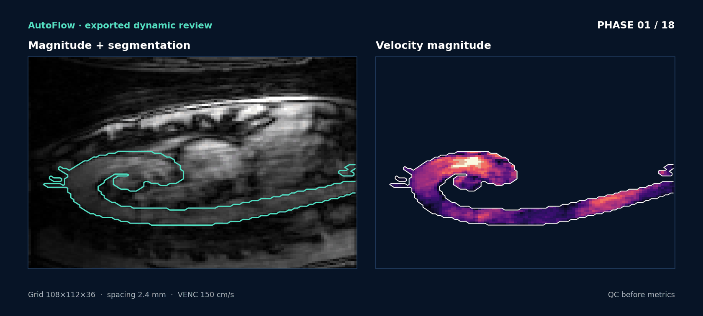

# 示例：主动脉 H5

## 示例数据

```text
/nas-data2/ryy/CMR4DFlow2026/Segdata/data4seg_test/h5s_autoflow/Aorta_Center003_GE_15T_Voyager_Exam32324-12224896-C17-0021.h5
```

这是 legacy complex H5：空间体数据、多个心动 phase、一个 magnitude 参考通道和三个复数速度编码通道。站点不会复制原始医学 H5；你需要在自己的环境中提供路径。



## CLI 跑完整功能

```bash
CASE=/path/to/Aorta_Center003_GE_15T_Voyager_Exam32324-12224896-C17-0021.h5

autoflow-run "$CASE" \
  --output-dir ./results/aorta_center003 \
  --bgc \
  --autoseg \
  --with pwv,wss,pg,vortex \
  --video plane,wss,pg,streamlines
```

这个命令依次完成加载、输入归一化、活动分割、骨架/图/路径/截面、基础截面指标，然后只运行你在 `--with` 和 `--video` 中请求的可选分析。

## GUI 跑同一个病例

```bash
autoflow-gui --config-dir ./configs
```

1. `File > Open H5` 打开文件。
2. 在 `Input & QC` 检查尺寸、方向、分辨率、VENC 和时间信息。
3. 在 `Segmentation` 选择分割来源，并在正交切面中检查边界。
4. 依次运行 `Skeleton`、`Graph/Paths`、`Planes`。
5. 在 `Hemodynamics` 选择 PWV、WSS、压力或涡旋。
6. 用 `Export > Export Videos...` 导出截面、WSS、压力或流线视频。

## 输出目录

```text
<output-root>/<case-name>/
├── summary.json
├── quality_report.json
├── planes.json
├── planes.h5
├── plane_positions.json
├── plane_metrics.json
├── plane_qc.json
├── pwv.json                  # 请求 PWV 时
├── *_wss*.npz / *_wss*.h5   # 请求 WSS 时
├── *_pressure*.npz / *.h5   # 请求压力时
└── *.mp4                    # 请求视频时
```

先看 `summary.json` 确认哪些阶段真的执行，再看 `quality_report.json` 和 `plane_qc.json`，最后才解释数值。首页视频只是文档演示，不是临床报告。
